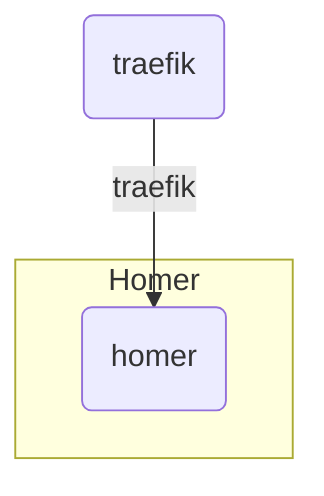

# Main


## Up local

[Up infrastructure](https://github.com/treeton-org/team#readme)

```shell
docker network create traefik
docker compose --env-file .env.local up
```

## Deploy on server

### Set secrets

* `SSH_DEPLOY_PRIVATE_KEY` - e.g. `AAAwEAA ...`

### Push code and check GitHub actions

[GitHub action](https://github.com/treeton-org/homer/actions/workflows/deploy.yaml)

## Docker network scheme

